The main problems are:

* ` ` tags break some Mermaid renderers
* parentheses and special chars inside node labels
* very long labels
* quotes/events like `'connect'`
* underscores are safer than spaces in IDs

Use this cleaned version:

```mermaid
flowchart TD

    Start([Start OMS]) --> InitAdapter[Initialize XTSMarketDataAdapter]
    InitAdapter --> CallConnect[Call marketData.connect]
    CallConnect --> CallLogin[Call login]

    %% Login Flow
    CallLogin --> CheckDummyLogin{baseUrl is ws or wss?}

    CheckDummyLogin -->|Yes| SkipLogin[Skip Login Dummy Data]
    CheckDummyLogin -->|No| SendLoginRequest[POST auth login with appKey and secretKey]

    SendLoginRequest --> ExtractToken[Extract token and userID]
    ExtractToken --> HasToken{Token received?}

    HasToken -->|No| LoginError[Login Failed Error]
    HasToken -->|Yes| LoginSuccess[Login Successful]

    SkipLogin --> LoginSuccess
    LoginError --> Exit([Exit])

    %% Connect Flow
    LoginSuccess --> CheckDummyConnect{baseUrl is ws or wss?}

    CheckDummyConnect -->|Yes| ConnectRawWS[Connect Raw WebSocket]
    CheckDummyConnect -->|No| ConnectSocketIO[Connect SocketIO with token and userID]

    %% Raw WebSocket Flow
    ConnectRawWS --> CreateWS[Create WebSocket]
    CreateWS --> WSEvents[Listen WebSocket Events]

    WSEvents --> WSOpen{Open event?}
    WSOpen -->|Yes| LogWSConnected[Log WS Connected]

    WSEvents --> WSMessage{Message event?}
    WSMessage -->|Yes| ParseWSMessage[Parse JSON Message]

    ParseWSMessage --> CallHandleMarketData[handleMarketData]

    WSEvents --> WSErrorClose{Error or Close event?}
    WSErrorClose -->|Yes| LogWSError[Log WS Error]

    %% SocketIO Flow
    ConnectSocketIO --> SetupSocketIOEvents[Setup SocketIO Events]

    SetupSocketIOEvents --> ListenConnect{Connect event?}
    ListenConnect -->|Yes| LogSocketIOConnected[Log SocketIO Connected]

    SetupSocketIOEvents --> Listen1502{1502 market event?}
    Listen1502 -->|Yes| ParseSocketIOMessage[Parse SocketIO JSON]

    ParseSocketIOMessage --> CallHandleMarketData

    SetupSocketIOEvents --> ListenSocketIOError{SocketIO error?}
    ListenSocketIOError -->|Yes| LogSocketIOError[Log SocketIO Error]

    %% handleMarketData Flow
    CallHandleMarketData --> CheckDummyData{Dummy data mode?}

    CheckDummyData -->|Yes| UseDefaultSymbol[Use DEFAULT_SYMBOL]
    CheckDummyData -->|No| CheckParsedSymbol{parsed.symbol exists?}

    CheckParsedSymbol -->|Yes| UseParsedSymbol[Use parsed.symbol]
    CheckParsedSymbol -->|No| CheckXTSFormat{Has ExchangeSegment and ExchangeInstrumentID?}

    CheckXTSFormat -->|Yes| CombineXTS[Build segment_instrument format]
    CheckXTSFormat -->|No| UseDefaultSymbol

    UseDefaultSymbol --> ResolveSymbolDone[Symbol Resolved]
    UseParsedSymbol --> ResolveSymbolDone
    CombineXTS --> ResolveSymbolDone

    ResolveSymbolDone --> ResolvePrice[Resolve Price]

    ResolvePrice --> HasPrice{Price found?}

    HasPrice -->|No| LogMissingPrice[Missing Price Warning]
    HasPrice -->|Yes| UpdateLastPrices[Update lastPrices Map]

    UpdateLastPrices --> UpdateLastSymbol[Update lastSymbol]

    UpdateLastSymbol --> EmitPriceUpdate[Emit priceUpdate Event]

    %% OrderManager Listener
    EmitPriceUpdate --> OrderManagerListen[OrderManager listens]

    OrderManagerListen --> RepairPositions[repairPositionsWithUnknownAvg]

    RepairPositions --> EmitToDashboard[Emit to Dashboard]

    style LoginError fill:#ffcccc
    style LogMissingPrice fill:#fff3cd
    style EmitPriceUpdate fill:#d4edda
    style EmitToDashboard fill:#d4edda
```

