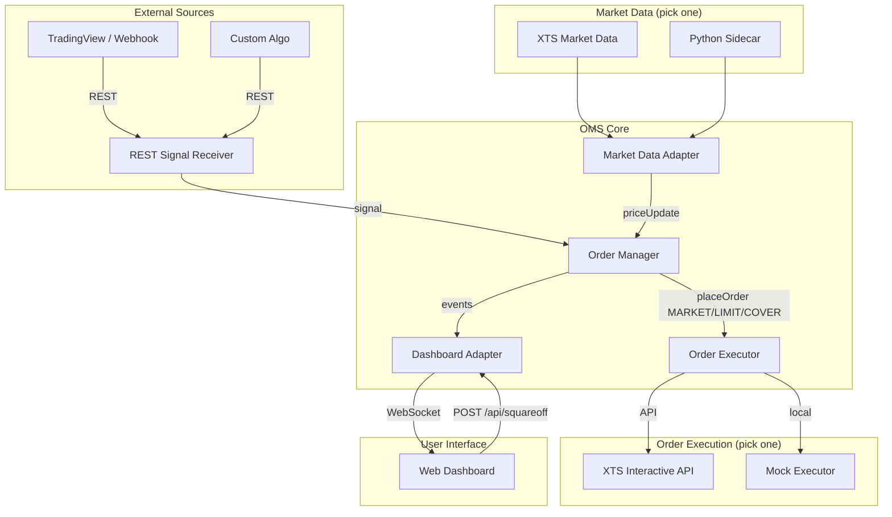

# Order Management System (OMS)

A loosely coupled Order Management System for automated trading. The OMS receives trade signals over REST, executes orders (market, limit, cover) through a broker adapter (XTS or mock), tracks positions locally, and streams live updates to a web dashboard.

## Key Features

- **Event-driven core** — Signals, market data, and order results flow through `OrderManager` as events.
- **Ports & adapters** — Core logic is independent of broker, market data source, signal format, and dashboard.
- **Real-time dashboard** — Web UI for positions, PnL, signal alerts, order book, and trade history via Socket.IO.
- **Pluggable providers** — Switch between XTS market data, a Python sidecar, or mock execution without changing core code.
- **Multiple order types** — Supports MARKET, LIMIT, and COVER orders with flexible parameters.
- **Position-aware signals** — Signals carry a target `position` (`long`, `short`, `flat`); `flat` triggers automatic square-off.
- **Manual square-off** — Exit positions from the dashboard or via the REST API.
- **Broker sync** — Local positions are reconciled with the broker every 30 seconds.
- **Durable state** — Orders, alerts, open positions, and trade history are saved to disk and restored on restart.

---

## System Architecture



### Signal → Order flow

1. A webhook hits `POST /signal` with `action`, `quantity`, and `position` (and optional `orderType`, `limitPrice`, `productType`, `instrumentType`).
2. `OrderManager` resolves the symbol from the signal, the active market data provider, or `DEFAULT_SYMBOL` (default `1_22`).
3. If `position` is `flat`, the open position for that symbol is squared off.
4. Otherwise an order (default LIMIT) is placed via the configured order executor — if no limit price is provided, it uses the current market price.
5. Local position state is updated and events are pushed to connected dashboard clients.

---

## Project Structure

```text
oms-with-xts-api/
├── public/                          # Dashboard frontend (HTML, CSS, JS)
├── data/                            # Created at runtime; oms-state.json is gitignored
├── src/
│   ├── adapters/
│   │   ├── DashboardAdapter.js      # Express + Socket.IO server for the UI
│   │   ├── MockOrderExecutor.js     # Logs orders locally (no broker calls)
│   │   ├── PythonSidecarAdapter.js  # Market data via a Python subprocess
│   │   ├── RESTSignalReceiver.js    # Webhook endpoint for trade signals
│   │   ├── XTSMarketDataAdapter.js  # XTS WebSocket market data
│   │   └── XTSOrderExecutor.js      # XTS REST order placement
│   ├── core/
│   │   ├── OrderManager.js          # Core coordination and position tracking
│   │   └── OmsStateStore.js         # JSON file persistence for OMS state
│   └── interfaces/                  # Abstract contracts (ports)
│       ├── MarketDataProvider.js
│       ├── OrderExecutor.js
│       └── SignalSource.js
├── .env                             # Local configuration (not committed)
├── .env.example                     # Configuration template
├── index.js                         # Bootstrap / adapter wiring
└── package.json
```

---

## Setup & Installation

### Prerequisites

- Node.js v16+
- For XTS mode: market data and interactive API credentials (or a local dummy XTS server)
- For Python sidecar mode: Python 3 and a script that prints trade lines to stdout

### Install

```bash
git clone <repository-url>
cd oms-with-xts-api
npm install
```

### Configure

Copy the example env file and edit values for your environment:

```bash
cp .env.example .env
```

See [Environment variables](#environment-variables) for all options.

### Run

```bash
node index.js
```

On startup the OMS connects market data, starts the signal receiver (default port `5001`), and serves the dashboard (default port `3000`).

---

## Quick Start (Mock Mode)

Run end-to-end without a broker or live market data:

```env
ORDER_EXECUTOR=mock
MARKET_DATA_PROVIDER=python
PYTHON_MOCK_PRICE=100.50
MARKET_DATA_SYMBOL=GOLD26
SIGNAL_PORT=5001
DASHBOARD_PORT=3000
```

```bash
node index.js
```

Open **http://localhost:3000**, then send a test signal:

```bash
curl -X POST http://localhost:5001/signal \
  -H "Content-Type: application/json" \
  -d '{"action": "BUY", "quantity": 100, "position": "long"}'
```

The dashboard should update immediately — positions, order book, and alerts — without a page reload.

To close the position:

```bash
curl -X POST http://localhost:5001/signal \
  -H "Content-Type: application/json" \
  -d '{"action": "SELL", "quantity": 100, "position": "flat"}'
```

Example payloads are also in `scratch/signal.json` and `scratch/flat_signal.json`.

---

## Environment Variables

| Variable | Default | Description |
| :--- | :--- | :--- |
| `ORDER_EXECUTOR` | *(XTS)* | Set to `mock` to use `MockOrderExecutor` (no broker API calls). |
| `MARKET_DATA_PROVIDER` | *(XTS)* | Set to `python` to use `PythonSidecarAdapter`. |
| `XTS_MARKET_DATA_URL` | — | XTS market data URL (HTTP base URL for standard XTS, or `ws://…` for dummy raw WebSocket). |
| `XTS_MARKET_DATA_APP_KEY` | — | XTS market data application key. |
| `XTS_MARKET_DATA_SECRET_KEY` | — | XTS market data secret key. |
| `XTS_SOURCE` | — | XTS API source (e.g. `WebAPI`). |
| `XTS_INTERACTIVE_URL` | — | XTS interactive API base URL. |
| `XTS_INTERACTIVE_APP_KEY` | — | XTS interactive application key. |
| `XTS_INTERACTIVE_SECRET_KEY` | — | XTS interactive secret key. |
| `XTS_INTERACTIVE_USER_ID` | — | XTS interactive user ID. |
| `PYTHON_MARKET_DATA_SCRIPT` | — | Path to Python script when using the sidecar adapter. |
| `MARKET_DATA_SYMBOL` | `btcusdt` | Active symbol for Python sidecar / symbol resolution. |
| `PYTHON_MOCK_PRICE` | — | If set, skips the Python subprocess and uses this fixed price. |
| `DEFAULT_SYMBOL` | `1_22` | Default instrument when the signal omits `symbol`. |
| `SIGNAL_PORT` | `5001` | Port for the REST signal webhook. |
| `DASHBOARD_PORT` | `3000` | Port for the web dashboard. |
| `OMS_STATE_PATH` | `<cwd>/data/oms-state.json` | Path to the persisted state file. |
| `OMS_MAX_STATE_ITEMS` | `5000` | Max entries kept per list (orders, alerts, history) when saving. |
| `OMS_UI_STATE_WINDOW` | `500` | How many recent orders/alerts/history rows the dashboard snapshot includes. |
| `OMS_PERSIST_DEBOUNCE_MS` | `400` | Debounce window for batched disk writes. |
| `OMS_DISABLE_PERSIST` | — | Set to `1` to disable loading/saving state (in-memory only). |

---

## Persistence

The OMS writes a single JSON snapshot (`data/oms-state.json` by default) containing:

- **orders** — Placed, failed, and squared-off order records  
- **alerts** — Signal log entries  
- **positions** — Local open position map (symbol → qty, average price, metadata)  
- **historicalPositions** — Closed trades for the history panel  

On **`OrderManager.init()`**, that file is loaded if it exists. After signals, order outcomes, position updates, broker sync merges, and square-offs, state is saved again (debounced writes; synchronous flush on `SIGINT` / `SIGTERM`).

The default state path is gitignored. For production, set **`OMS_STATE_PATH`** to a persistent volume path.

---

## Local Development with Dummy XTS API

When pointing at a local dummy XTS server (e.g. `http://127.0.0.1:8001`), the order executor uses:

| Operation | Method | Path |
| :--- | :--- | :--- |
| Place order | `POST` | `/interactive/orders` |
| Get positions | `GET` | `/portfolio/positions` |
| Square off | `POST` | `/interactive/positions/squareoff` |

Symbol format for XTS orders is `{exchangeSegment}_{exchangeInstrumentId}` (e.g. `1_22`). If no underscore is present, segment `1` is assumed.

---

## Signal API

Receives trade intent and triggers order placement or square-off.

- **URL:** `http://localhost:5001/signal`
- **Method:** `POST`
- **Content-Type:** `application/json`

### Request body

| Field | Type | Required | Description |
| :--- | :--- | :--- | :--- |
| `action` | `string` | Yes | `BUY` or `SELL` (case-insensitive). |
| `quantity` | `number` | Yes | Number of units to trade. |
| `position` | `string` | Yes | Target position: `long`, `short`, or `flat`. |
| `symbol` | `string` | No | Instrument identifier. If omitted, resolved from the market data provider's active symbol, then falls back to `1_22`. |
| `orderType` | `string` | No | Order type: `MARKET`, `LIMIT`, or `COVER` — default: `LIMIT`. |
| `limitPrice` | `number` | No | Limit price (required for LIMIT orders if no current market price is available). |
| `stopLossPrice` | `number` | No | Stop loss price (for COVER orders). |
| `productType` | `string` | No | Product type: `MIS`, `NRML`, or `CNC` — default: `MIS`. |
| `instrumentType` | `string` | No | Instrument type: `EQUITY`, `OPTIONS`, `FUTURES`, `COMMODITY`.

### Behaviour

- **`position: "flat"`** — Squares off the full open position for the resolved symbol. No new order is placed unless a position exists.
- **Other positions** — Places an order (default LIMIT) for `action` / `quantity` and updates local position tracking.

### Examples

Open a long position:

```bash
curl -X POST http://localhost:5001/signal \
  -H "Content-Type: application/json" \
  -d '{"action": "BUY", "quantity": 100, "position": "long"}'
```

Square off:

```bash
curl -X POST http://localhost:5001/signal \
  -H "Content-Type: application/json" \
  -d '{"action": "SELL", "quantity": 100, "position": "flat"}'
```

With an explicit symbol:

```bash
curl -X POST http://localhost:5001/signal \
  -H "Content-Type: application/json" \
  -d '{"symbol": "1_22", "action": "BUY", "quantity": 1, "position": "long"}'
```

### Response

**200 OK**

```json
{ "status": "Signal received", "action": "BUY", "quantity": 100, "position": "long" }
```

**400 Bad Request** — missing required fields.

---

## Dashboard

**URL:** http://localhost:3000

### Panels

| Panel | Description |
| :--- | :--- |
| Open Positions | Live qty, average price, LTP, and PnL per symbol |
| Signal Alerts | Incoming webhook signals |
| Order Book | Placed, failed, and squared-off orders |
| Trade History | Closed positions with entry/exit prices and realised PnL |

Header stats show connection status, active position count, and total unrealised PnL.

### REST endpoints

| Method | Path | Description |
| :--- | :--- | :--- |
| `GET` | `/api/state` | Full snapshot (positions, orders, alerts, history) |
| `POST` | `/api/squareoff/:symbol` | Manually square off a symbol |

### WebSocket events (Socket.IO)

Clients connect and receive an initial `state` event, then incremental updates:

| Event | Payload | Description |
| :--- | :--- | :--- |
| `state` | `{ positions, orders, alerts, historicalPositions }` | Full state on connect |
| `alert` | signal object | New incoming signal |
| `order` | order object | Order placed, failed, or squared off |
| `positionUpdate` | `{ symbol, qty, avgPrice }` | Single position changed |
| `priceUpdate` | `{ symbol, price }` | Market price tick |
| `historyUpdate` | closed trade object | Position closed |
| `positionsSynced` | position array | Broker reconciliation (every 30s) |

---

## Python Sidecar Market Data

When `MARKET_DATA_PROVIDER=python`, Node spawns a Python script and parses stdout for trade lines:

```text
TRADE | buy | price=3124.50 | vol=0.0450 | ...
```

Configure the script path and symbol:

```env
MARKET_DATA_PROVIDER=python
PYTHON_MARKET_DATA_SCRIPT=/path/to/your/market_data.py
MARKET_DATA_SYMBOL=btcusdt
```

For development without a live feed, set a fixed price instead:

```env
PYTHON_MOCK_PRICE=100.50
```

---

## Extending the System

The core depends only on interfaces in `src/interfaces/`. To add a new integration:

1. Create an adapter in `src/adapters/` implementing the relevant interface.
2. Wire it in `index.js` (follow the `createMarketData()` / `createOrderExecutor()` pattern).
3. Optionally add an env flag to select it at runtime.

Examples already in the repo:

- **New broker** — implement `OrderExecutor` (see `XTSOrderExecutor`, `MockOrderExecutor`).
- **New signal source** — implement `SignalSource` (see `RESTSignalReceiver`).
- **New market data feed** — implement `MarketDataProvider` (see `XTSMarketDataAdapter`, `PythonSidecarAdapter`).

---

## License

Proprietary / Internal Use
