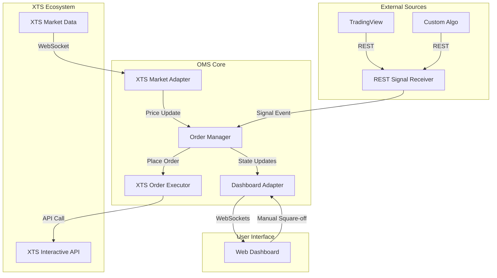

# Order Management System (OMS)

A high-performance, loosely coupled Order Management System (OMS) designed for automated trading. This system receives trade signals via a REST interface, executes orders through the XTS (X-TS) Interactive API, and provides a real-time monitoring dashboard for tracking positions, alerts, and live PnL.

## 🚀 Key Features

- **Event-Driven Architecture**: Built on a robust event-driven core that processes signals and market data updates asynchronously.
- **Hexagonal Architecture (Ports & Adapters)**: High level of decoupling between core business logic and external services (Brokers, Signal Sources, Market Data Providers, Dashboards).
- **Real-time Monitoring Dashboard**: A sleek, web-based terminal to monitor open positions, signal logs, order book, and live PnL updates via WebSockets.
- **Manual Intervention**: Capability to square off positions directly from the dashboard.
- **Real-time Synchronization**: Subscribes to XTS Market Data WebSockets to maintain an up-to-date local order book and price cache.
- **RESTful Signal Gateway**: Easily integrate with TradingView, Python scripts, or any webhook-capable system.

---

## 🏗️ System Architecture

The OMS follows the **Ports and Adapters** pattern, ensuring that the core `OrderManager` remains agnostic of specific broker implementations or signal formats.



---

## 📂 Project Structure

```text
oms/
├── public/             # Dashboard Frontend (HTML/CSS/JS)
├── src/
│   ├── adapters/       # Concrete implementations of interfaces
│   │   ├── RESTSignalReceiver.js  # Express server for webhooks
│   │   ├── XTSMarketDataAdapter.js # XTS WebSocket client
│   │   ├── XTSOrderExecutor.js    # XTS REST client for orders
│   │   └── DashboardAdapter.js    # Socket.io server for the UI
│   ├── core/           # Business logic
│   │   └── OrderManager.js        # Core coordination logic
│   └── interfaces/     # Abstract definitions (Contracts)
│       ├── MarketDataProvider.js
│       ├── OrderExecutor.js
│       └── SignalSource.js
├── .env                # Secret management
├── index.js            # Bootstrap/Entry point
└── package.json        # Dependencies
```

---

## ⚙️ Setup & Installation

### Prerequisites
- Node.js (v16 or higher)
- Active XTS API credentials (Market Data & Interactive)

### 1. Clone & Install
```bash
git clone <repository-url>
cd oms
npm install
```

### 2. Configure Environment
Create a `.env` file in the root directory:
```env
# XTS Credentials
XTS_MARKET_DATA_URL="https://eztrade.wealthdiscovery.in/apimarketdata"
XTS_INTERACTIVE_URL="https://eztrade.wealthdiscovery.in/apiinteractive"
XTS_APP_KEY="your_app_key"
XTS_SECRET_KEY="your_secret_key"
XTS_SOURCE="WebAPI"

# Port Configuration
SIGNAL_PORT=5001
DASHBOARD_PORT=3000
```

### 3. Run the System
```bash
node index.js
```

---

## 🖥️ OMS Dashboard

Once the system is running, you can access the monitoring dashboard at:
**`http://localhost:3000`**

### Features:
- **Live Positions**: View all open positions with real-time PnL calculation.
- **Signal Log**: Instant notifications of incoming signals from external sources.
- **Order Book**: Track the execution status of all orders.
- **Square-Off**: Quick action buttons to exit positions manually if needed.

---

## 📩 Signal API Reference

### Receive Signal
Triggers a new order placement.

- **URL**: `/signal`
- **Method**: `POST`
- **Content-Type**: `application/json`

**Body**:
| Field | Type | Description |
| :--- | :--- | :--- |
| `symbol` | `string` | The instrument identifier (e.g., "1_22") |
| `action` | `string` | "BUY" or "SELL" |
| `quantity` | `number` | The number of units to trade |
| `priceType`| `string` | (Optional) Default: "MARKET" |

**Example Request**:
```bash
curl -X POST http://localhost:5001/signal \
     -H "Content-Type: application/json" \
     -d '{"symbol": "1_22", "action": "BUY", "quantity": 1}'
```

---

## 🛠️ Extending the System

The system is designed for extensibility. To add a new broker:
1.  Create a new adapter in `src/adapters/` (e.g., `ZerodhaOrderExecutor.js`).
2.  Inherit from the relevant interface in `src/interfaces/`.
3.  Swap the implementation in `index.js`.

---

## 📝 License
Proprietary / Internal Use
